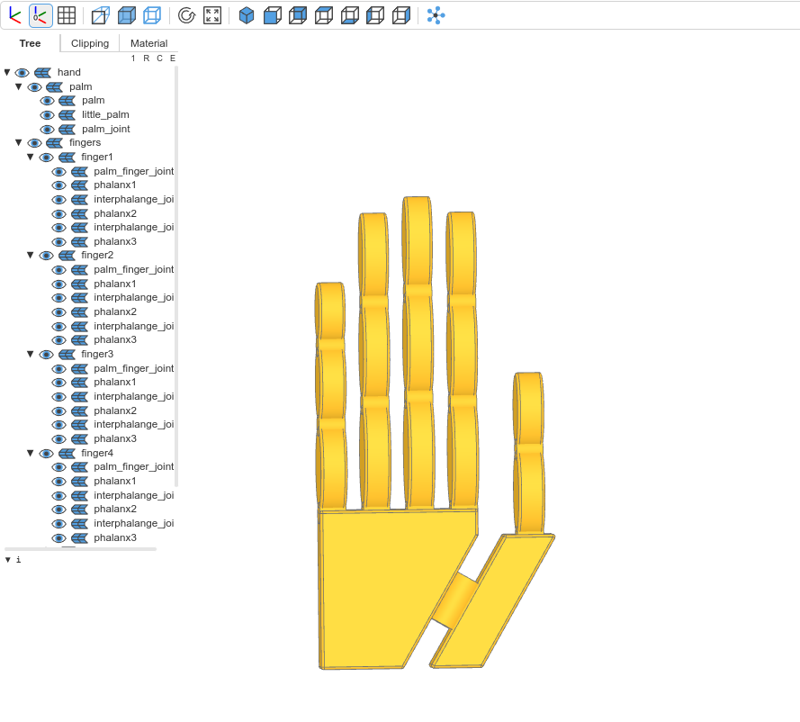

## Robotic Hand with build123d

This repository contains the code for creating a robotic hand with [build123d](https://build123d.readthedocs.io/) python based scripting CAD. The main script is robotic_hand.py which uses parameters from parameters.yaml to generate the 3D model of the robotic hand. The code is meant to be used with [vscode-ocp-cad-viewer](https://github.com/bernhard-42/vscode-ocp-cad-viewer).

### Files

    robotic_hand.py: This is the main script that generates the 3D model of the robotic hand. It uses the parameters from parameters.yaml to define the dimensions and characteristics of the hand. It includes functions to create the palm, thumb, and joints of the hand.

    parameters.yaml: This file contains the parameters for the robotic hand. It includes parameters for the palm, thumb, joints, and other global parameters.

## Usage
TODO